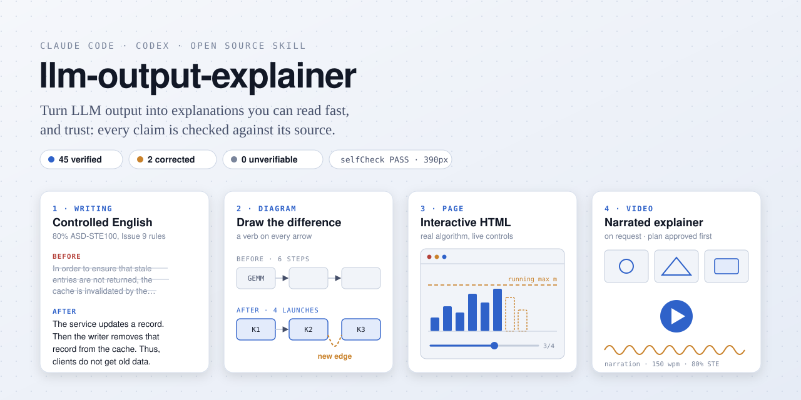
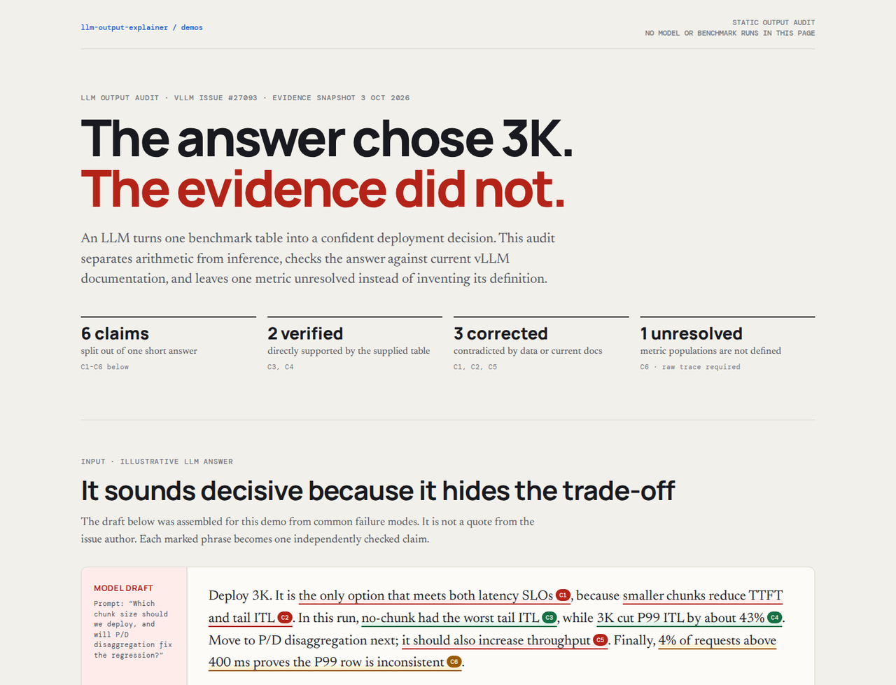
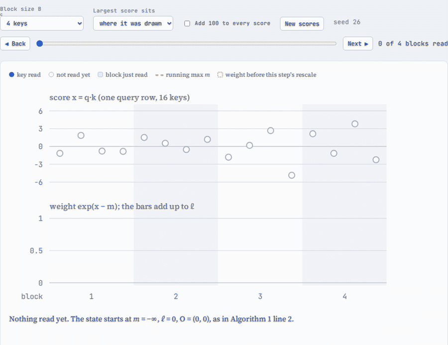
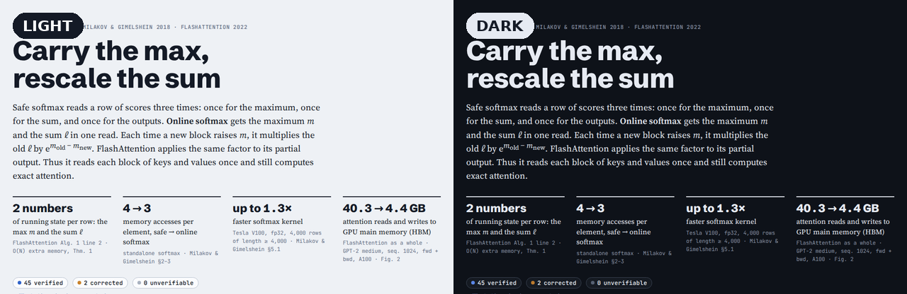
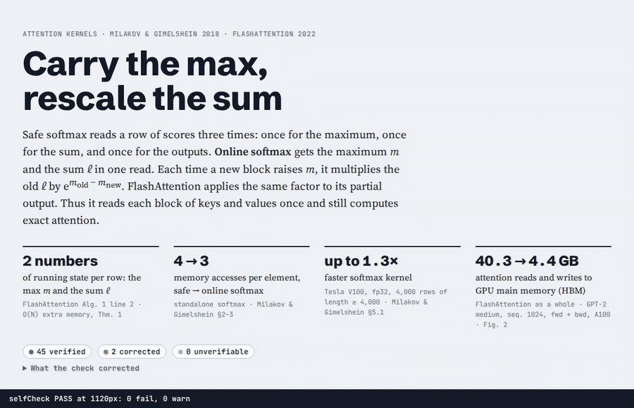

# llm-output-explainer

<p align="center">
  
</p>

<p align="center">
  <a href="https://johnqinamd.github.io/llm-output-explainer/chunked-prefill-audit.html"><b>▶ Output-audit demo</b></a> &nbsp;·&nbsp;
  <a href="#install">Install</a> &nbsp;·&nbsp;
  <a href="#four-formats">Formats</a> &nbsp;·&nbsp;
  <a href="#what-it-adds">What it adds</a>
</p>

<p align="center">
  
  
  
  
</p>

A Codex and Claude Code skill that explains code, papers, pull requests and results in the format that is fastest to understand. It checks every claim against its source before it writes anything.

The idea comes from [Andrej Karpathy's post](https://x.com/karpathy/status/2105819303471976479). People spend more and more time reading what language models produce. Writing in a controlled language, drawing diagrams, building interactive pages, and making explainer videos can make that output easier to understand.

## See it in action

### Audit a confident LLM answer

The main demo audits an LLM recommendation for a real vLLM chunked-prefill performance report. It checks six claims against the reported measurements and current documentation, corrects three claims, and refuses to guess one missing metric definition.

<p align="center">
  <a href="https://johnqinamd.github.io/llm-output-explainer/chunked-prefill-audit.html"></a>
</p>

[**Read the static chunked-prefill audit →**](https://johnqinamd.github.io/llm-output-explainer/chunked-prefill-audit.html)

### Step through the real algorithm

The simulator runs the FlashAttention update for one query row. Move through the blocks to see the running maximum, the rescaled weights and the partial output change together.

<p align="center">
  <a href="https://johnqinamd.github.io/llm-output-explainer/"></a>
</p>

### One page, two themes

The same tokens and diagrams work in light and dark mode. The page follows the browser preference, and it also supports an explicit `data-theme` override.

<p align="center">
  
</p>

### The page checks itself

Open any generated page with `#selfcheck` to test horizontal overflow, overlapping SVG labels and undersized SVG text. This capture first shows a passing page, then injects an intentional 1,450 px overflow at capture time so you can see the real checker find and outline it. The published demo stays unchanged.

<p align="center">
  <a href="https://johnqinamd.github.io/llm-output-explainer/#selfcheck"></a>
</p>

Try the secondary interactive page: [**open the Online Softmax demo →**](https://johnqinamd.github.io/llm-output-explainer/)

## Four formats

| Format | Use it when | Output |
|---|---|---|
| Controlled English, 80% [ASD-STE100](https://www.asd-ste100.org/) | answers, summaries, procedures (the default in chat) | the reply |
| Diagram | the point is a structure: data flow, before and after, states | a page with one figure |
| Interactive HTML page | several parts, numbers, or a mechanism to play with | a private Artifact or a standalone .html file |
| Narrated video | only on request: an idea that unfolds over time | an .mp4 |

The skill picks a format from the request. If you name one ("explain in STE", "make it HTML"), it uses that format.

## What it adds

- **The skill checks facts first.** It keeps a claim ledger: each claim, its source (`file:line`, commit, URL) and a status. Every arrow, label and number in a figure counts as a claim too. The skill cuts unsupported claims and tells you about corrected ones.
- **Independent checks run in parallel.** On a multi-agent host, the skill automatically delegates bounded, read-only evidence streams while the root agent prepares the explanation. Evidence agents are read-only, and one background builder owns the page file, so agents do not contend over shared output.
- **Live state before notes.** For a pull request, `scripts/pr_facts.sh` reads the current state from the GitHub API. It shows whether the PR merged, the head SHA, each commit, and the trailers on the merge commit.
- **STE rules checked against the standard.** `references/ste-writing.md` cites the rule numbers of ASD-STE100 Issue 9 (2025-01-15). `scripts/ste_lint.py` flags common rule breaks and names the rule for each.
- **Pages check themselves.** The starter page includes `selfCheck()`, which flags overflow, overlapping labels and text that is too small, at any screen width. Add `#selfcheck` to the URL to outline the problems. `scripts/check_page.py` checks the page before you publish it.
- **Written for a reader.** The skill writes differently for you, for a peer reviewer, or for a manager, and it can apply your own rules for each audience.

## Demos

[**Chunked prefill audit**](https://johnqinamd.github.io/llm-output-explainer/chunked-prefill-audit.html) is the primary demo. It starts with an illustrative LLM answer about a real vLLM performance report, then:

- splits the answer into six independently checkable claims.
- preserves the benchmark's scope instead of generalizing one 8 × H20 result.
- shows the TTFT–P99 ITL trade-off as a frontier, not a single winning configuration.
- distinguishes a contradicted claim from a claim that cannot be resolved without raw metric definitions.
- rewrites the answer as an operator-ready recommendation with explicit missing evidence.

Its source is [`docs/chunked-prefill-audit.html`](docs/chunked-prefill-audit.html). It is a static report; no model or benchmark runs in the page.

### Online Softmax

[**Online softmax**](https://johnqinamd.github.io/llm-output-explainer/) is a page the skill made in a test, from the FlashAttention and Milakov & Gimelshein papers. In the browser you can:

- change the block size and step through one row, block by block.
- watch the running max rise and every earlier weight shrink by the same factor.
- add 100 to every score and see plain float32 softmax overflow while the online sum does not.
- open "What the check corrected" to see the two claims the fact check fixed.

The page passes its own `selfCheck()` at phone and desktop width, in light and dark mode. Its source is [`docs/index.html`](docs/index.html).

## Install

In Codex:

```
codex plugin marketplace add JohnQinAMD/llm-output-explainer
codex plugin add llm-output-explainer@llm-output-explainer
```

Start a new Codex conversation after installation. To install only the skill, copy `skills/explain/` to `~/.codex/skills/explain/`.

Subagent delegation is automatic when the host exposes multi-agent tools and permits proactive delegation. The skill cannot enable or override that host policy itself. For an API-managed Codex session, enable [`multi_agent.enabled`](https://developers.openai.com/api/docs/guides/responses-multi-agent); the platform default is three concurrent subagents, while this skill normally uses two. Without that capability, the skill uses batched single-agent checks instead.

## How it stays fast

- The root keeps the prompt and main source, then gives every remaining source to one owner. Agents do not duplicate the same search.
- Two read-only subagents are the default for multi-source work. Small or sequential tasks stay single-agent because orchestration would make them slower.
- Evidence subagents return compact ledger rows, not prose drafts. One builder writes the page once from the brief, so there are no competing output files to merge.
- The root prepares the outline while evidence checks run, verifies decision-changing claims first, and stops research when every material claim has adequate evidence.
- Only the selected format guide is loaded. Cheap local validators run directly on the frozen final draft instead of becoming another delegated task.

In Claude Code:

```
claude plugin marketplace add JohnQinAMD/llm-output-explainer
claude plugin install llm-output-explainer@llm-output-explainer
```

Or copy `skills/explain/` to `~/.claude/skills/explain/`.

## Use

Ask in plain words. The skill loads when the request fits. To call it directly, use `/llm-output-explainer:explain` (plugin) or `/explain` (copied skill).

A page, diagram or video is built in a background subagent. The skill checks the facts and answers in chat. Then it writes a brief with the claim ledger and hands the build to the subagent, so you can continue to work. The link arrives when the build is done. Without a background subagent, the skill builds the page itself.

```
explain in STE how the scheduler picks which requests run in a step
make an interactive page for online softmax
summarize PR 1234 in vllm-project/vllm for the reviewers
```

## Files

```
skills/explain/
├── SKILL.md                    the workflow: format, fact check, reader, delivery
├── references/ste-writing.md   ASD-STE100 Issue 9 rules and dictionary notes
├── references/build.md         what the background builder does with a brief
├── references/html-page.md     page workflow, figure rules, page sections
├── references/video.md         narrated video steps
├── assets/skeleton.html        starter page: themes, chart helpers, self-check
├── assets/palettes.css         three validated palettes, light and dark
└── scripts/
    ├── new_page.py             starts a page from the skeleton and a palette
    ├── check_page.py           checks an Artifact fragment or standalone page
    ├── ste_lint.py             flags STE rule breaks
    └── pr_facts.sh             live state of a GitHub pull request
```

`docs/chunked-prefill-audit.html` is the primary static demo, and `docs/index.html` is the Online Softmax demo. GitHub Pages serves both. `scripts/capture_readme_assets.py` records the README images from those pages, so the showcase stays tied to the real implementation.

## Requirements

- Python 3 for the scripts. `check_page.py` installs `esprima` into `~/.cache/llm-output-explainer/` the first time it parses JavaScript.
- `curl` for `pr_facts.sh`. To raise the GitHub API rate limit, set `GH_TOKEN_FILE` to a file that holds a token.
- Optional: Docker, for a headless browser check or for video (`manimcommunity/manim`).
- For background builds, a host that runs subagents in the background, such as Claude Code.

## Notes on STE

This project is not affiliated with ASD or STEMG. The skill writes in the style of ASD-STE100. It never claims that a text complies with the standard, because the standard says that no tool can certify that. The standard and its dictionary are free from [asd-ste100.org](https://www.asd-ste100.org/). This repository does not include them.

## Related projects

- [karpathy-output-style](https://github.com/ashryaagr/karpathy-output-style): four skills for the same four formats, with Excalidraw diagrams and ElevenLabs narration.
- [visual-explainer](https://github.com/nicobailon/visual-explainer): HTML diagrams, slides and visual diff reviews.

## License

MIT. See [LICENSE](LICENSE).
